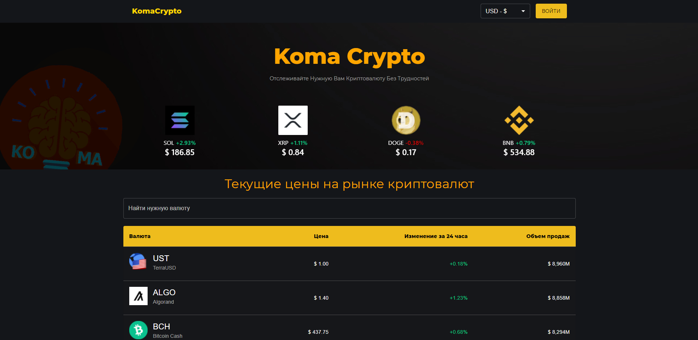
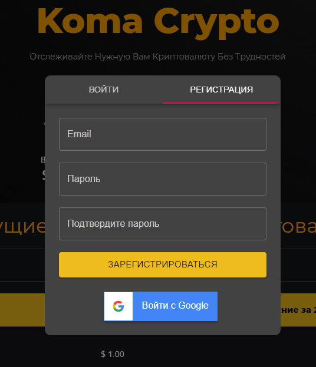
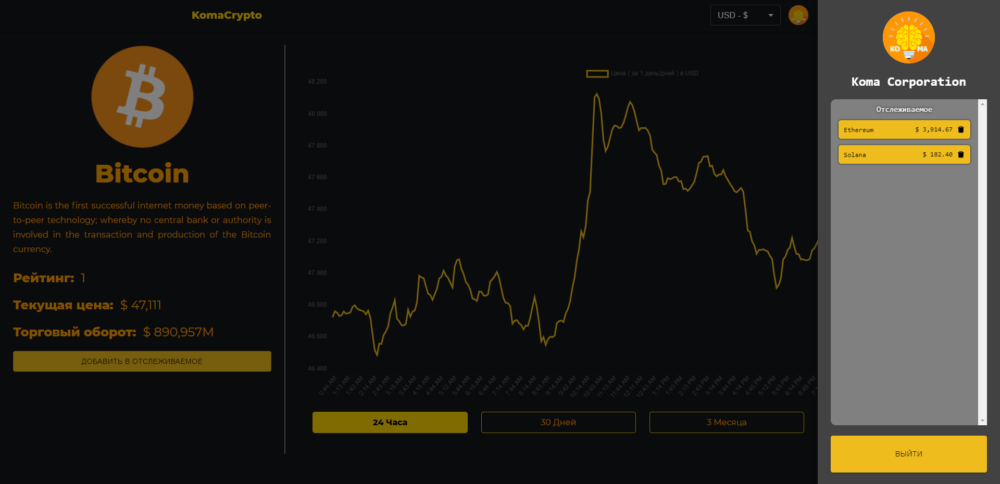

# Koma CryptoCurrency
## Made with Firebase-Firestore and MUI

### Demo - https://koma-crypto.netlify.app/

<h4>Dependencies:</h4>
<ul>
<li>material-ui</li>
<li>material-ui/lab</li>
<li>axios</li>
<li>chart.js</li>
<li>firebase</li>
<li>react-alice-carousel</li>
<li>react-chartjs-2</li>
<li>react-google-button</li>
<li>react-html-parser</li>
</ul>

